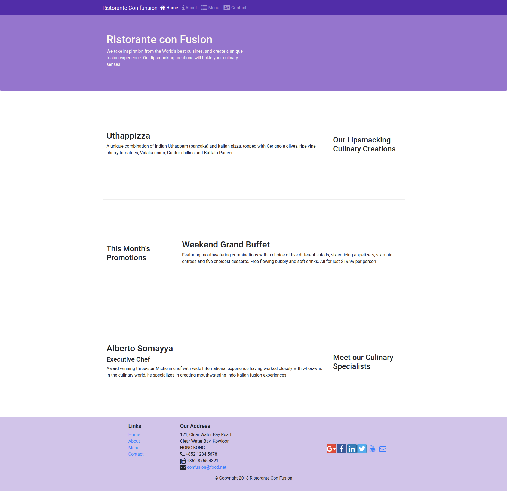

# Coursera: Front-End Web UI Frameworks and Tools: Bootstrap 4
## Specialization: Full-Stack Web Development with React 

This repository contains the web page built during the lessons of the course. It will change as I move on the course.

## Folder structure

```
├── aboutus.html
├── contactus.html
├── css
│   └── styles.css
├── helper
│   ├── index.png
│   └── log_installation
├── index.html
├── package.json
├── package-lock.json
└── README.md
```

## Start lite server.
```
npm start
```

## index.html preview as 31/07/2020

