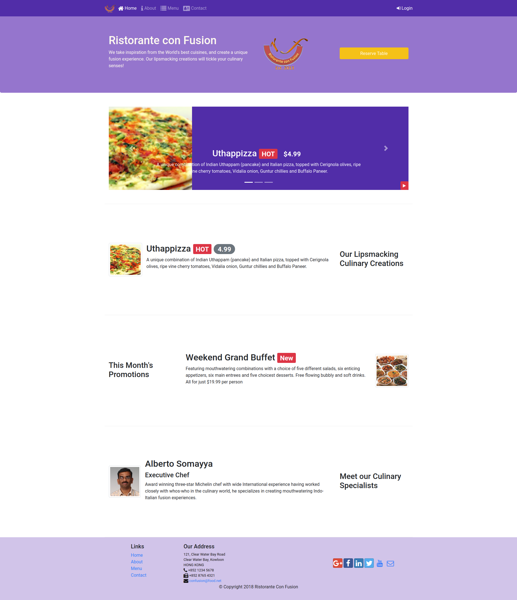

# Ristorante conFunsion web site design.

This repository contains the web page built during the lessons of the course. 
It will change as I move on the course.

The end result can be visited in http://garisplace.com/full_stack_sp/project1/dist/index.html

## Folder structure

```
├── aboutus.html
├── contactus.html
├── css
│   ├── styles.css
│   ├── styles.less
│   ├── styles-old.css
│   └── styles.scss
├── helper
│   ├── index.png
│   └── log_installation
├── img
│   ├── alberto.png
│   ├── buffet.png
│   ├── logo.png
│   └── uthappizza.png
├── index.html
├── js
│   └── scripts.js
├── package.json
├── package-lock.json
├── README.md
```

## Start lite server.
```
npm start
```

## index.html preview as 26/08/2020

